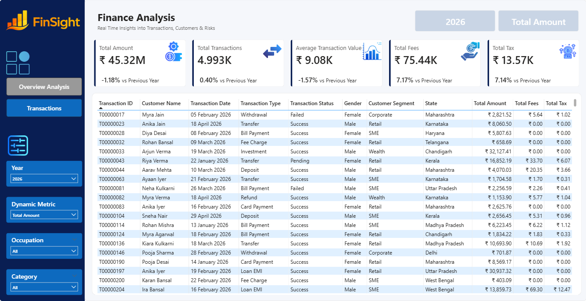

# 💰 Finance Analytics Dashboard - Power BI

An interactive **Finance Analytics Dashboard** built in **Power BI** to analyze financial transactions, customer behavior, transaction performance, fees, taxes, and business growth trends.

The dashboard provides real-time insights into financial performance across customer segments, transaction types, states, and demographics, enabling data-driven decision-making.

---

## 📌 Project Objective

The objective of this project is to build a centralized financial analytics solution that helps stakeholders:

- Monitor overall financial performance
- Track transaction growth and trends
- Analyze customer segments and demographics
- Evaluate transaction success rates
- Understand fee and tax generation
- Identify top-performing states and customer groups
- Support business strategy through data-driven insights

---

## 🛠️ Tools & Technologies Used

- Power BI
- Power Query
- DAX
- Data Modeling
- Data Visualization
- Business Intelligence
- Financial Analytics

---

## 📂 Dataset Information

The project uses two datasets:

### 1. Customers Dataset
Contains customer-related information such as:

- Customer ID
- Customer Name
- Gender
- Occupation
- Customer Segment
- State

### 2. Finance Transactions Dataset
Contains transaction-related information such as:

- Transaction ID
- Transaction Date
- Transaction Type
- Transaction Status
- Amount
- Fees
- Tax

---

## 📊 Dashboard Pages

### 1️⃣ Overview Analysis

Provides a high-level summary of financial performance.

#### KPI Cards

- Total Amount
- Total Transactions
- Average Transaction Value
- Total Fees
- Total Tax

#### Visualizations

- Total Amount by Month
- Total Amount by Transaction Status
- Total Amount by Customer Segment
- Total Amount by State (Top 10)
- Transaction Type Analysis
- Total Amount by Gender

---

### 2️⃣ Transactions Analysis

Provides detailed transaction-level records.

#### Features

- Transaction Drill-Down
- Detailed Transaction Grid
- Customer Information Analysis
- Transaction Status Monitoring
- Dynamic Filtering
- Record-Level Exploration

---

## 🎯 Key Business Insights

### Financial Performance

- Monitor overall transaction growth and business performance.
- Track annual financial trends and changes.

### Customer Analysis

- Identify high-value customer segments.
- Analyze gender-wise financial contribution.
- Understand customer demographics and behavior.

### Transaction Analysis

- Compare successful, failed, and pending transactions.
- Analyze profitability across transaction categories.
- Evaluate transaction performance and operational efficiency.

### Regional Analysis

- Identify top-performing states.
- Compare financial contribution across regions.

### Revenue Components

- Track fee collection trends.
- Monitor tax generation from transactions.

---

## 📈 Dashboard Features

### Dynamic Filters

Users can interactively filter the dashboard by:

- Year
- Dynamic Metric
- Occupation
- Category

### Interactive Reporting

- Drill-through analysis
- Dynamic slicers
- Cross-filtering
- KPI monitoring
- Detailed transaction reporting

---

## 📷 Dashboard Screenshots

### Overview Analysis


### Transactions Analysis



---

## 📁 Project Structure

```text
Finance-Analytics-Dashboard-Power-BI/
│
├── Images Used/
│   ├── Logo.png
│   ├── filter.png
│   ├── gross (3).png
│   ├── histogram.png
│   ├── menu (3).png
│   ├── taxes.png
│   ├── toilet-.png
│   ├── transaction (1).png
│   ├── verified.png
│   └── wage.png
│
├── Business Requirements.docx
├── Finance Analysis Dashboard.pbix
├── Overview Analysis.png
├── Transactions.png
├── customers.csv
├── finance_transactions.csv
└── README.md
```

---

## 📌 Business Requirements Covered

✅ Financial KPI Monitoring

✅ Monthly Transaction Trend Analysis

✅ Customer Segment Analysis

✅ State-wise Performance Analysis

✅ Transaction Status Analysis

✅ Transaction Type Profitability Analysis

✅ Gender-based Analysis

✅ Year-over-Year Performance Tracking

✅ Detailed Transaction Drill-Down Reporting

---

## 🚀 Outcome

This project demonstrates how Power BI can be used to transform raw financial transaction data into actionable business insights.

By leveraging KPI reporting, DAX calculations, interactive visualizations, and dynamic filtering, the dashboard enables stakeholders to:

- Monitor financial performance in real time
- Identify growth opportunities
- Improve operational efficiency
- Understand customer behavior
- Support strategic decision-making

---

## 👨‍💻 Author

**Abhishek Savita**

GitHub: https://github.com/Abhishek-Savita-3012

---
⭐ If you found this project useful, consider giving it a star!
